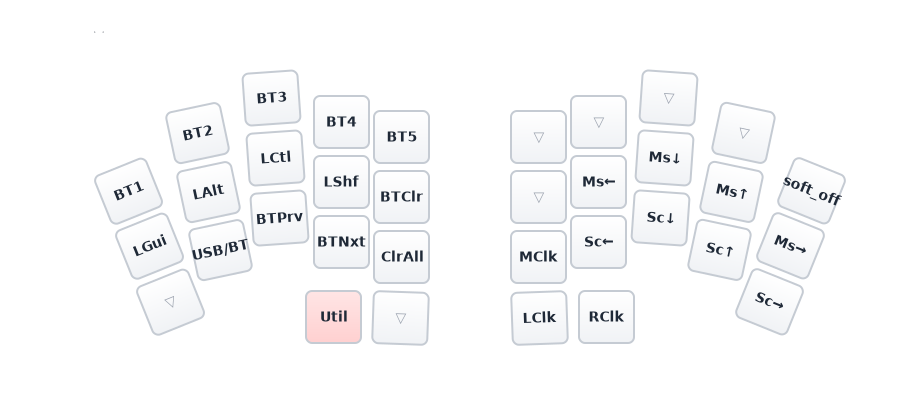
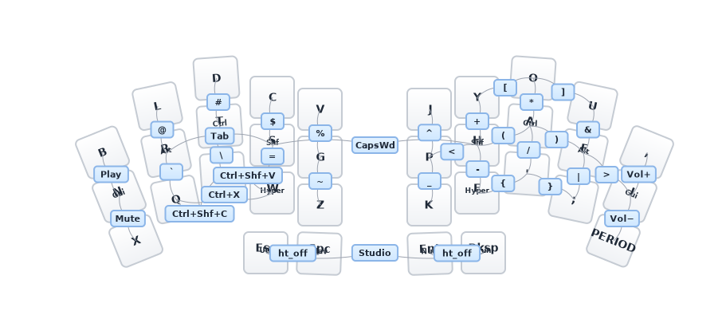

# Delta Omega

ZMK firmware for the Delta Omega 34-key split keyboard, running on two Seeed XIAO nRF52840 controllers. Based on the [delta-omega](https://github.com/unspecworks/delta-omega) design.

## Layout

**Gallium** alpha layout with home row mods (GACS order), 34 combos, mouse keys, and 6 layers.

### Base (Gallium)


- **Home row mods** (GACS): Gui/Alt/Ctrl/Shift on left, mirrored on right
- **Hyper** (all 4 mods) on W and F
- **Thumb layer-taps**: ESC/Util, Space/Nav, Enter/Num, Bksp/Fun

### Nav (hold Space)


### Num (hold Enter)


### Fun (hold Backspace)


### Util + Mouse (hold Escape)



### Game (toggle from Fun layer)


## Combos



| Type | Timeout | Prior idle | Examples |
|------|---------|------------|----------|
| Vertical (top+home) | 80ms | 150ms | `@` `#` `$` `%` `^` `+` `*` `&` |
| Vertical (home+bottom) | 80ms | 150ms | `` ` `` `\` `=` `~` `_` `-` `/` `\|` |
| Horizontal (adjacent) | 40ms | 280ms | `[` `]` `<` `(` `)` `>` `{` `}` |
| Multi-key | 50ms | 200ms | Tab (3-key), CapsWord, Studio unlock |
| Thumb | — | — | LShift, RShift |

## Home Row Mods

| Setting | Value |
|---|---|
| Flavor | balanced (positional hold-tap) |
| Tapping term | 280ms |
| Quick tap | 175ms |
| Require prior idle | 150ms |
| Hold trigger | opposite hand + thumbs only |

Thumb layer-taps use **balanced** flavor with 200ms tapping term for fast layer activation.

## Hardware

| Component | Detail |
|---|---|
| Base design | [delta-omega](https://github.com/unspecworks/delta-omega) |
| Controllers | 2x Seeed XIAO nRF52840 |
| Keys | 34 (3x5 + 2 thumb per hand) |
| Switches | Kailh PG1316S (ultra-low-profile, SMD) |
| Matrix | 4x10 (col2row) |
| Connection | USB-C or Bluetooth (5 profiles) |

## Building

### Local (Nix)

```bash
nix develop          # enter dev shell
just init            # initialize west workspace (first time)
just build           # build left + right + settings_reset
just bootloader      # download XIAO bootloader
just update          # west update
```

Outputs go to `build/`:
- `delta-omega-left.uf2` (central)
- `delta-omega-right.uf2` (peripheral)
- `delta-omega-reset.uf2` (bond/settings reset)

### GitHub Actions

Push to `config/` or `boards/` triggers a build via ZMK's reusable workflow. Download UF2 artifacts from the Actions tab.

### Regenerate layer SVGs

```bash
just gen-svg    # regenerates assets/svg/layers/*.svg from keymap
```

## Flashing

1. Double-tap reset on the XIAO to enter UF2 bootloader (mounts as `XIAO-SENSE`)
2. Copy the appropriate `.uf2` file to the mounted drive
3. Flash left half first, then right half

To clear Bluetooth bonds, flash `delta-omega-reset.uf2` on **both** halves, then reflash the regular firmware.

## ZMK Studio

Runtime keymap editing is enabled. Unlock with the combo at thumb key positions 30 + 33.
