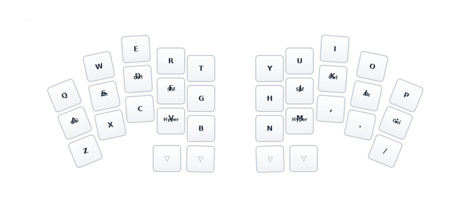

# Delta Omega

ZMK firmware & config for the [**unspecworks/delta-omega**](https://github.com/unspecworks/delta-omega) — a 34-key split keyboard running on two Seeed XIAO nRF52840 controllers with Kailh PG1316S switches.

A single firmware containing both **Gallium** (default) and **QWERTY** layouts. Switch between them with the toggle key at Util top-right; QWERTY reverts to Gallium on reboot.

## Firmware Modes

Three firmware configurations are supported, each targeting a different hardware setup:

| Mode | Central | Peripheral halves | Screen |
|------|---------|-------------------|--------|
| **Standalone** | Left half (XIAO) | Right half (XIAO) | none |
| **Dongle** | Separate XIAO dongle | Both halves (XIAO) | none |
| **Prospector** | Separate XIAO dongle + [Prospector LCD](https://github.com/carrefinho/prospector-zmk-module) | Both halves (XIAO) | LCD status screen |

Use standalone if you plug a USB cable into one of the halves. Use dongle or prospector if you want a dedicated USB dongle (better latency, always-on).

## Layout

**Gallium** alpha layout with home row mods (GACS order), 34 combos, mouse keys, and 7 layers (including a runtime QWERTY toggle).

### Base (Gallium)


- **Home row mods** (GACS): Gui/Alt/Ctrl/Shift on left, mirrored on right
- **Hyper** (all 4 mods) on W and F
- **Thumb layer-taps**: ESC/Util, Space/Nav, Enter/Num, Bksp/Fun

### Nav (hold Space)


### Num (hold Enter)


### Fun (hold Backspace)


### Util + Mouse (hold Escape)


### QWERTY (toggle from Util top-right)



The QWERTY layer is a runtime toggle — tap the top-right key on the Util layer to enable it. It reverts to Gallium on reboot.

### Game (toggle from Fun layer)


## Combos


| Type | Timeout | Prior idle | Examples |
|------|---------|------------|---------|
| Vertical (top+home) | 80ms | 150ms | `@` `#` `$` `%` `^` `+` `*` `&` |
| Vertical (home+bottom) | 80ms | 150ms | `` ` `` `\` `=` `~` `_` `-` `/` `\|` |
| Horizontal (adjacent) | 40ms | 280ms | `[` `]` `<` `(` `)` `>` `{` `}` |
| Multi-key | 50ms | 200ms | Tab (3-key), CapsWord, Studio unlock |
| Thumb | — | — | LShift, RShift |

## Home Row Mods

| Setting | Value |
|---|---|
| Flavor | balanced (positional hold-tap) |
| Tapping term | 280ms |
| Quick tap | 175ms |
| Require prior idle | 150ms |
| Hold trigger | opposite hand + thumbs only |

Thumb layer-taps use **balanced** flavor with 200ms tapping term for fast layer activation.

## Hardware

| Component | Detail |
|---|---|
| Base design | [delta-omega](https://github.com/unspecworks/delta-omega) |
| Controllers | 2x Seeed XIAO nRF52840 (halves) + optional dongle XIAO |
| Keys | 34 (3x5 + 2 thumb per hand) |
| Switches | Kailh PG1316S (ultra-low-profile, SMD) |
| Matrix | 4x10 (col2row) |
| Connection | USB-C or Bluetooth (5 profiles) |

## Building

### Local (Nix)

```bash
nix develop          # enter dev shell
just init            # initialize west workspace (first time)
just build           # build all three modes
just update          # west update
```

`just build` runs all three modes and produces:

```
build/
  standalone/
    delta-omega-left.uf2      # left half (central)
    delta-omega-right.uf2     # right half (peripheral)
  dongle/
    delta-omega-dongle.uf2    # screenless XIAO dongle
    delta-omega-left.uf2      # left half (peripheral)
    delta-omega-right.uf2     # right half (peripheral)
  prospector/
    delta-omega-prospector.uf2  # Prospector LCD dongle
    delta-omega-left.uf2        # left half (peripheral)
    delta-omega-right.uf2       # right half (peripheral)
  settings-reset.uf2            # clears BLE bonds on any role
```

You can also build individual modes:

```bash
just build-standalone    # standalone mode only
just build-dongle        # screenless dongle mode only
just build-prospector    # Prospector LCD dongle mode only
```

### GitHub Actions

Pushing changes under `config/`, `tools/`, or `build.yaml` triggers `.github/workflows/build.yml`, which:
1. regenerates the layer SVGs and commits them, then
2. builds firmware via ZMK's reusable workflow.

Download the UF2 artifacts from the Actions tab:
- `delta-omega-standalone-left` / `delta-omega-right`
- `delta-omega-left-peripheral` (for dongle modes)
- `delta-omega-dongle` / `delta-omega-prospector`
- `delta-omega-settings-reset`

### Regenerate layer SVGs

```bash
just gen-svg    # regenerates assets/svg/layers/*.svg from keymap
```

## Flashing

### Standalone mode

Flash `standalone/delta-omega-left.uf2` to the left half and `standalone/delta-omega-right.uf2` to the right half.

1. Double-tap reset on the XIAO to enter UF2 bootloader (mounts as `XIAO-SENSE`)
2. Copy the `.uf2` file to the mounted drive
3. Flash left half first, then right half

### Dongle mode (screenless or Prospector)

Flash order matters for correct Bluetooth pairing and Prospector battery widget ordering:

1. Flash the dongle (`dongle/` or `prospector/` firmware)
2. Double-tap reset on **both** halves to clear any old bonds
3. Pair the **left half first**, then the right half

This ensures the Prospector battery widgets are assigned in the correct order (left = slot 0, right = slot 1).

### Clearing Bluetooth bonds

Flash `settings-reset.uf2` on **all** devices (dongle + both halves), then reflash the regular firmware. This clears all stored bond information.

## ZMK Studio

Runtime keymap editing is enabled. Unlock with the combo at thumb key positions 30 + 33.
